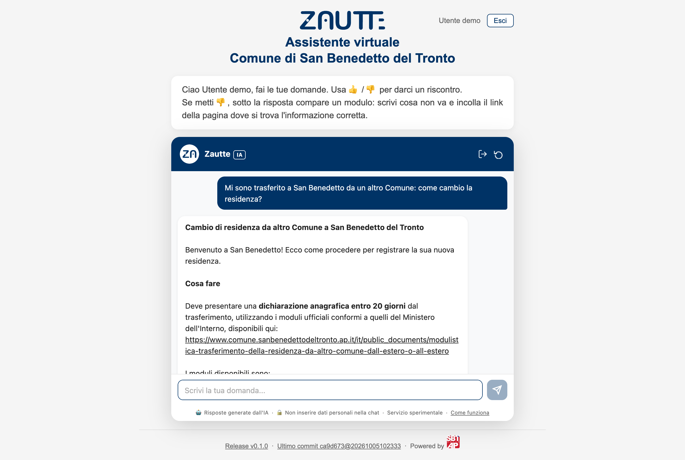
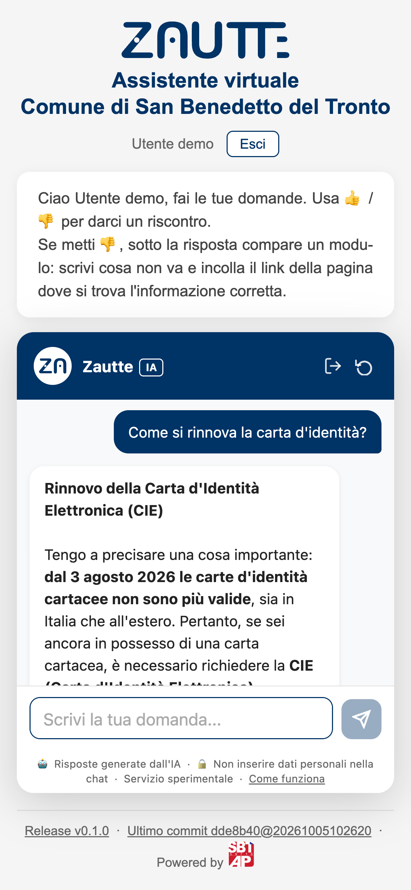
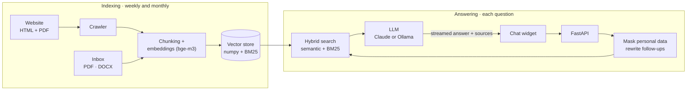
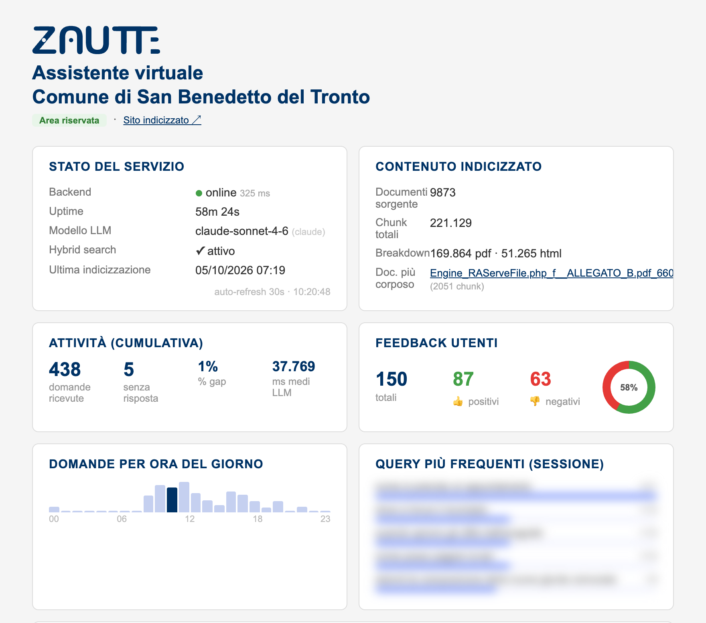

<p align="center">
  <picture>
    <source media="(prefers-color-scheme: dark)" srcset="docs/zautte-logo-dark.svg">
    
  </picture>
</p>

<h3 align="center">A virtual assistant that answers questions using only your website's content</h3>

<p align="center">
  <a href="https://github.com/Antonio-Prado/zautte/actions/workflows/ci.yml"></a>
  <a href="https://github.com/Antonio-Prado/zautte/actions/workflows/codeql.yml"></a>
  <a href="https://github.com/Antonio-Prado/zautte/releases"></a>
  
  
  <a href="LICENSE"></a>
</p>

Zautte is a **RAG** (Retrieval-Augmented Generation) assistant for public-sector and other content-heavy websites. It crawls the site's pages and PDFs, finds the passages relevant to each question and lets an LLM answer **from those passages only, citing its sources**. Personal data is masked before anything reaches the model or the logs.

It runs in production as a pilot for the **Comune di San Benedetto del Tronto** (Italy), on a single FreeBSD server with no database and no containers.

<p align="center">
  
  &nbsp;
  
</p>
<p align="center"><sub>The pilot's interface is in Italian; the widget also speaks English.</sub></p>

## Features

|  |  |
|---|---|
| 🔎 **Answers grounded in the site**<br>Hybrid search (semantic + BM25) over pages, PDFs and uploaded documents; every answer lists its sources. | 💬 **Follow-up questions**<br>"And what does it cost?" is rewritten with its topic before searching, so conversations keep their context. |
| 🛡️ **Privacy by design**<br>Tax codes, IBANs, cards, emails and phone numbers are masked; embeddings are always computed locally; retention periods for logs. | 🔌 **Drop-in widget**<br>One `<script>` tag, vanilla JS with no dependencies, streaming answers, floating or inline, mobile-friendly, Italian and English. |
| 👍 **Feedback loop**<br>Users rate answers and can point to the right page; admins resolve reports and the user is notified by email. | 🔄 **Self-updating index**<br>Weekly incremental and monthly full crawl; only new or changed chunks are re-embedded; nightly backups and a watchdog. |
| 🧠 **Your choice of LLM**<br>Claude through the Anthropic API or AWS Bedrock (EU, Milan region), or a fully local model with Ollama. | 📊 **Admin dashboard**<br>Service status, indexed content, activity, feedback, users, token costs, crawl history and changelog. |

## How it works



Every question is masked, rewritten if it is a follow-up, expanded with synonyms and searched both by meaning and by keywords. The best chunks, plus curated "known facts" for topics the site covers poorly, go to the LLM with instructions to use nothing else. Questions the site cannot answer are logged for review. Details: [How it works](docs/how-it-works.md).

## In production

<table>
  <tr>
    <td align="center"><b>221,129</b><br><sub>chunks indexed</sub></td>
    <td align="center"><b>9,873</b><br><sub>pages and documents</sub></td>
    <td align="center"><b>80 / 100</b><br><sub>test questions with the right page<br>among the chunks given to the LLM</sub></td>
    <td align="center"><b>weekly</b><br><sub>incremental crawl,<br>full crawl monthly</sub></td>
  </tr>
</table>

<sub>Figures from October 2026. The retrieval score went from 58 to 80 out of 100 when the embedding model changed from `mxbai-embed-large` to `bge-m3`.</sub>

<details>
<summary><b>Admin dashboard</b> (user questions, names and costs blurred)</summary>
<br>
<p align="center"></p>
</details>

## Quick start

You need FreeBSD 15 with [Ollama](https://ollama.com) installed and running; the full list of prerequisites is in [Installation](docs/installation.md).

```sh
git clone https://github.com/Antonio-Prado/zautte.git /opt/chatbot
cd /opt/chatbot
sh scripts/setup_freebsd.sh            # as root: packages, virtualenv, requirements
ollama pull bge-m3                     # embedding model, always local

cp .env.example .env                   # set SITE_URL, SITE_NAME, LLM_PROVIDER, keys
venv/bin/python -m scripts.sync full   # crawl the site and build the index
venv/bin/python -m uvicorn api.main:app --host 0.0.0.0 --port 8000
```

Then add the widget to your site's pages:

```html
<script>
  window.ChatbotConfig = { apiUrl: 'https://chatbot.example.org', title: 'Zautte' };
</script>
<script src="https://chatbot.example.org/widget/chatbot-widget.js" defer></script>
```

> [!NOTE]
> With `LLM_PROVIDER=ollama` nothing leaves the server. With `claude` or `bedrock`, the masked question, the last turns of the conversation and the retrieved passages are sent to the provider. See [Privacy and Security](docs/privacy-and-security.md).

## Documentation

| | |
|---|---|
| 🏗️ [Architecture](docs/architecture.md) | Components, technology stack, repository layout |
| 📦 [Installation](docs/installation.md) | Prerequisites, setup on FreeBSD, first indexing |
| ⚙️ [Configuration](docs/configuration.md) | `.env` variables, retrieval thresholds and weights |
| 🧭 [How it works](docs/how-it-works.md) | RAG pipeline, crawler, indexer, vector store |
| 🔌 [Backend API](docs/api.md) | Endpoints, streaming, login, admin authentication |
| 💬 [Frontend Widget](docs/widget.md) | Embedding the chat, options, bundled pages |
| 🛠️ [Operations](docs/operations.md) | Cron jobs, rc.d service, monitoring, troubleshooting, changing models |
| 🛡️ [Privacy and Security](docs/privacy-and-security.md) | GDPR, what is stored, rate limits |

## Built with

Python 3.11 · FastAPI and uvicorn · Ollama (`bge-m3` embeddings) · numpy · rank-bm25 · httpx, BeautifulSoup and lxml · pypdf · Claude (Anthropic API or AWS Bedrock) · vanilla JavaScript · FreeBSD rc.d, cron and newsyslog.

## Contributing and security

Contributions are welcome: see [CONTRIBUTING.md](CONTRIBUTING.md). To report a vulnerability, follow [SECURITY.md](SECURITY.md).

Released under the [MIT License](LICENSE) · © 2026 Antonio Prado.

<sub>Documentation updated: October 2026</sub>
